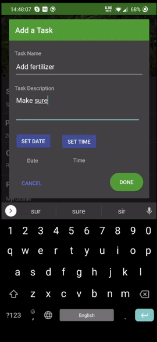

# 🌼 Horto

[About](#About) ∙ [Overview of Features](#Overview-of-features) ∙ [What's Next?](#What's-Next?)

## About

An android application based on garden management, using a plant-based API known as [Trefle](https://github.com/treflehq/trefle-api). Features AR to give users the ability to design gardens using plant models available. This was created as a final year project developed over a course of 2 months.

Horto was created using Java and the Android SDK with OpenGL ES and ARCore driving the AR functionality.

## Overview of features

### Garden design

Create small designs using the model options given

### Plant Management

Add tasks based on specific plants

## What's Next?

The 3rd of May marked the end of support for the Trefle API, which is unfortunate. This makes Horto, as it stands, unusable, which is why I haven't provided an `.apk` with this repo. However, I am currently working on an improved version of this application using [**Flutter**](https://flutter.dev/) for the main application features and design with [**Unity**](https://unity3d.com) being used to develop the core AR functionality. As for now, this version of the app acts as a proof of concept.
